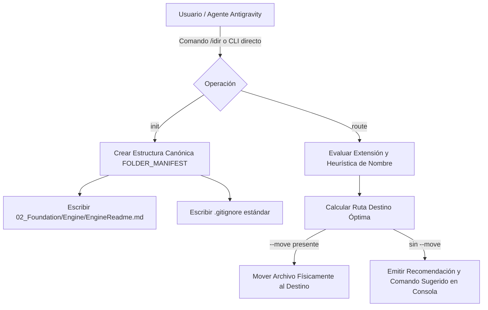

<!-- ============================================================================== -->
<!-- THINKINGSEED: ADN DEL PROYECTO (CONTEXTO PASIVO PARA MODELOS DE LENGUAJE)     -->
<!-- ============================================================================== -->
> [!NOTE]
> ### 🧬 DEFINICIÓN Y ROL DE ESTE DOCUMENTO
> 1. **¿Qué es este archivo?:** Este documento es una **Semilla de Proyecto (ThinkingSeed Master)**: representa el **ADN arquitectónico, técnico y estructural exhaustivo** del sistema. **NO es el repositorio completo de código fuente**, sino su mapa genético y memoria técnica profunda extraída directamente del entorno de desarrollo.
> 2. **Estado de Avance (Work in Progress):** Este documento refleja el **estado actual del desarrollo**. No garantiza que el proyecto esté concluido al 100%; puede representar un prototipo, un MVP o un sistema en evolución continua. La ausencia de código completo en ciertos archivos o módulos es **deliberada por diseño** para optimizar ventana de contexto o refleja áreas aún en desarrollo.
> 3. **Modo de Operación:** Trata este documento como **contexto pasivo de referencia técnica (Ground Truth)**. No asumas que el archivo está defectuoso ni intentes reescribirlo por tu cuenta.
<!-- ============================================================================== -->

# THINKING SEED MASTER: iDirectory

## 0. IDENTIDAD Y METADATOS
```yaml
seed_schema_version: "2.0"
project_name: "iDirectory"
repository_name: "iDirectory"
project_type: "infra"
repository_mode: "single-project"
generated_at: "2026-09-17T22:02:40-03:00"
generated_by: "Antigravity Agent (Gemini Flash)"
repository_root: "d:/0001 HyperScale Thinking/PROYECTOS CLOUD/iContext/iDirectory"
git_branch: "master"
git_commit: "3f0e2f0"
working_tree_state: "clean"
analysis_mode: "static"
coverage_level: "high"
known_analysis_limits:
  - "Inspección estática basada en código fuente, manifiestos del framework, árbol de directorios y configuración de agente Antigravity."
```

### 0.1 Instrucciones para el modelo receptor
1. **ADN vs Repositorio:** Reconoce este documento como la memoria técnica y el ADN del proyecto, no como el repositorio completo ni como una prueba de ejecución.
2. **Contexto Pasivo:** No generes código no solicitado ni reclames por archivos ausentes; espera instrucciones específicas del usuario o utilízalo como contexto pasivo para responder preguntas sobre el funcionamiento del sistema.
3. **Estado de Avance:** Considera que las secciones incompletas o componentes marcados como `[FALTANTE]` representan el avance real del proyecto y oportunidades de asistencia, no errores del documento.
4. **Evidencia:** Respeta las etiquetas de evidencia y no transformes inferencias en hechos.
5. **Rutas:** Antes de proponer cambios, identifica módulos y archivos afectados citando sus rutas exactas relativas al repositorio.
6. **Contratos:** Conserva arquitectura, convenciones, contratos y restricciones declaradas.
7. **Preguntas Dirigidas:** No inventes componentes ausentes. Formula preguntas solo cuando la incertidumbre impida una respuesta segura.
8. **Seguridad:** No reveles ni solicites secretos. Usa placeholders (`<REDACTED>`).
9. **Impacto:** Evalúa impactos laterales en pruebas, configuración, datos, seguridad, observabilidad y despliegue.
10. **Asistencia:** Distingue entre solución inmediata, deuda técnica y recomendación futura.

---

## 1. RESUMEN EJECUTIVO
- **1.1 Proyecto en una frase:** Framework de gobernanza, ruteo heurístico inteligente y scaffolding estandarizado (**iDirectory**), creado por **Gravity HyperScale Thinking** y concebido para proyectos Multi-Cloud (GCP, AWS, Azure, Fabric), Data Engineering, Inteligencia Artificial / LLMs y sistemas analíticos. `[CONFIRMADO]`
- **1.2 Problema que resuelve:** Erradica el caos organizativo, la deriva estructural y la dispersión de artefactos heterogéneos en repositorios modernos de alta escala, proporcionando un mapa canónico tanto a ingenieros humanos como a agentes de IA autónomos. `[CONFIRMADO]`
- **1.3 Usuarios o sistemas consumidores:** Ingenieros Cloud, Arquitectos de Datos, Científicos de Datos, Desarrolladores de IA y Agentes Autónomos de Codificación (Antigravity, Gemini CLI, Claude, Copilot). `[CONFIRMADO]`
- **1.4 Alcance y límites del sistema:** Incluye el motor CLI (`FWengine.py`), manifiesto canónico de directorios (`FOLDER_MANIFEST`), motor de ruteo y reubicación heurística (`ROUTING_MAP`), integración con skills de Antigravity (`/idir`, `GEMINI.md`) y generación de documentación técnica bilingüe de nivel académico (`README.md`, `README_ES.md`). No incluye ejecución de cargas de datos remotas ni provisión de cloud en tiempo de ejecución. `[CONFIRMADO]`

---

## 2. ARQUITECTURA Y TOPOLOGÍA
- **2.1 Estilo arquitectónico:** Motor de Scaffolding y Gobernanza desacoplado, autocontenido en Python Standard Library (`pathlib`, `argparse`, `sys`, `os`), complementado con integración agéntica y documentación formal Paper-Grade. `[CONFIRMADO]`
- **2.2 Árbol estructural del repositorio:**
```text
iDirectory/
├── .agents/                                # Customizaciones y skills locales del agente
│   └── skills/
│       └── idir/                           # Skill canónica /idir para gobernanza automática
│           └── SKILL.md
├── 001_Seed/                               # Semilla de proyecto y memoria técnica (ThinkingSeed Master)
│   └── seed-idirectory-master.md
├── 02_Foundation/
│   └── Engine/                             # Núcleo del framework y manifiesto de gobernanza
│       └── EngineReadme.md                 # Documentación maestra generada de directorios
├── 03_Research_AI/                         # Investigación e Inteligencia Artificial
│   ├── Notebooks/                          # Notebooks de exploración (EDA, algoritmos interactivos)
│   ├── llm_prompts/                        # System prompts, árboles de contexto y plantillas LLM
│   └── experiments/                        # PoCs, prototipos de modelos y benchmarks
├── src/                                    # Código fuente productivo
│   ├── cloud_jobs/                         # Scripts de producción y pipelines Multi-Cloud (Fabric, AWS, GCP, Azure)
│   ├── data_generation/                    # Generación y simulación de datos sintéticos
│   ├── core/                               # Lógica de negocio modular y backend
│   └── dashboards/                         # Tableros BI y visualización (Streamlit, PowerBI, Dash)
├── data/                                   # Arquitectura Medallion local (Ignorado en Git)
│   ├── raw/                                # Bronze: Fuentes puras e inmutables
│   ├── processed/                          # Silver/Gold: Datos transformados y optimizados
│   └── sandbox/                            # Zona de experimentación rápida
├── schemas/                                # Definiciones formales de esquemas (Avro, JSON Schema, DDL)
├── infrastructure/                         # IaC Multi-Cloud (Terraform, Bicep, ARM, CDK)
├── config/                                 # Parámetros de entorno y variables desacopladas
├── tests/                                  # Pruebas unitarias, integración y calidad de datos
├── Artefactos/                             # Entregables y planes estratégicos
│   └── Planes/
│       ├── Vigentes/                       # Planes de capacidad activos (F-SKUs, presupuestos)
│       └── Historico_Obsoletos/            # Histórico de arquitecturas descartadas y respaldo
├── docs/                                   # Documentación técnica viva
│   ├── architecture/                       # Diagramas de arquitectura y flujos Medallion
│   ├── technical_specs/                    # Especificaciones funcionales y no funcionales
│   └── engineers_notes/                    # Bitácoras de ingeniería y RCA
├── Tools/                                  # Utilitarios locales, linters y scripts de debugging
├── scripts/                                # Scripts operativos (bash, powershell, make)
├── logs/                                   # Trazas locales de ejecución y auditoría
├── FWengine.py                             # Motor principal del framework (CLI de inicialización y ruteo)
├── GEMINI.md                               # Reglas inviolables del proyecto y gobernanza Antigravity
├── README.md                               # Documentación de alta ingeniería formal (Inglés)
├── README_ES.md                            # Documentación de alta ingeniería formal (Español)
└── .gitignore                              # Reglas de exclusión para datos y entornos
```
- **2.3 Responsabilidad por directorio y archivo clave:**
  - `FWengine.py`: Orquestador CLI principal que alberga `FOLDER_MANIFEST` y `ROUTING_MAP`. `[CONFIRMADO]`
  - `GEMINI.md`: Manifiesto de instrucciones y reglas inviolables para agentes de IA Antigravity con enlace al comando rápido `/idir`. `[CONFIRMADO]`
  - `.agents/skills/idir/SKILL.md`: Declaración formal de la habilidad del agente para invocar `FWengine.py`. `[CONFIRMADO]`
  - `02_Foundation/Engine/EngineReadme.md`: Documento derivado que describe la gobernanza para desarrolladores y agentes en el espacio de trabajo. `[CONFIRMADO]`
- **2.4 Límites modulares y acoplamiento:** Desacoplamiento total; `FWengine.py` no depende de librerías de terceros (Zero-Dependency CLI). `[CONFIRMADO]`

---

## 3. FLUJOS DE EJECUCIÓN Y ENTRY POINTS
- **3.1 Puntos de entrada principales:**
  - `python FWengine.py init [path]`: Inicializa el andamiaje canónico de carpetas y genera `02_Foundation/Engine/EngineReadme.md` y `.gitignore`. `[CONFIRMADO]`
  - `python FWengine.py route <file> [--move] [--base <path>]`: Audita y clasifica un archivo según su extensión y heurística nominal, recomendando o reubicando físicamente el elemento. `[CONFIRMADO]`
  - Invocación vía Slash Command `/idir`: Agentes Antigravity ejecutan la lógica CLI de forma contextual y transparente. `[CONFIRMADO]`
- **3.2 Diagrama de flujo principal E2E:**

- **3.3 Ciclo de vida de la ejecución y estados:**
  1. Lectura de argumentos vía `argparse`.
  2. Verificación de existencia de archivo objetivo (en comando `route`).
  3. Mapeo probabilístico/determinista por extensión y keywords de nombre de archivo.
  4. Salida informativa por consola (`stdout`) con código de retorno `0`. `[CONFIRMADO]`

---

## 4. MODELO DE DATOS, CONTRATOS Y PERSISTENCIA
- **4.1 Esquemas y entidades principales:**
  - `FOLDER_MANIFEST` (`dict[str, str]`): Diccionario clave-valor que mapea rutas relativas de carpetas con su propósito canónico. `[CONFIRMADO]`
  - `ROUTING_MAP` (`dict[str, str]`): Mapeo determinista de extensiones (`.py`, `.ipynb`, `.md`, `.sql`, `.tf`, `.yaml`, `.csv`, `.parquet`, etc.) a sus carpetas de destino. `[CONFIRMADO]`
- **4.2 Almacenamiento, motores y migraciones:** Persistencia directa en sistema de archivos local utilizando operaciones seguras de `pathlib.Path` (`mkdir(parents=True, exist_ok=True)`, `rename`). `[CONFIRMADO]`
- **4.3 Interfaces externas:** No aplica contratos REST/gRPC directos; el contrato es a nivel de CLI y flags estándar (`--move`, `--base`). `[CONFIRMADO]`

---

## 5. CONFIGURACIÓN Y AMBIENTE
- **5.1 Tabla de variables de entorno:**
| Variable | Tipo | Default | Efecto | Sensible |
| :--- | :--- | :--- | :--- | :--- |
| N/A | N/A | N/A | Sin variables de entorno obligatorias; CLI autocontenido en Python Standard Library. | No `[CONFIRMADO]` |
- **5.2 Perfiles de ejecución:** Entorno universal (dev, staging, prod) soportado mediante parametrización en subdirectorio `config/`. `[CONFIRMADO]`
- **5.3 Prerrequisitos de sistema:** Python 3.8+ instalado en el entorno ejecutor (Windows, Linux, macOS). `[CONFIRMADO]`

---

## 6. PRUEBAS, CI/CD Y OPERACIÓN
- **6.1 Estrategia de pruebas:** Suite de pruebas unitarias proyectada en subcarpeta `tests/` para verificar la idempotencia de `init` y la precisión del ruteador heurístico. `[DECLARADO]`
- **6.2 Automatización y pipelines CI/CD:** Compatible con GitHub Actions o pre-commit hooks para verificar que nuevos archivos cumplan con las reglas de `route`. `[INFERIDO]`
- **6.3 Operación:** Ejecutable como script interactivo o integrado en automatizaciones agénticas de Antigravity. `[CONFIRMADO]`

---

## 7. OBSERVABILIDAD Y MODOS DE FALLA
- **7.1 Logs y métricas:** Impresión estructurada en `stdout` durante la ejecución CLI y preservación de logs del sistema en `logs/`. `[CONFIRMADO]`
- **7.2 Modos de falla conocidos y estrategias de recuperación:**
  - *Archivo inexistente en `route`:* El motor captura la excepción, emite mensaje descriptivo en consola y retorna de forma controlada sin fallar el proceso. `[CONFIRMADO]`
  - *Conflicto de destino existente:* `pathlib.Path.rename` sobrescribe en sistemas POSIX o puede generar error en Windows si el archivo destino existe; mitigable verificando destino antes de mover. `[INFERIDO]`
- **7.3 Idempotencia:** El comando `init` es completamente idempotente (`exist_ok=True`). `[CONFIRMADO]`

---

## 8. SEGURIDAD Y PRIVACIDAD
- **8.1 Hallazgos de seguridad estática:** Zero external dependencies (Cero superficie de ataque por dependencias vulnerables en la capa base). `[CONFIRMADO]`
- **8.2 Manejo de secretos:** Sin almacenamiento de credenciales ni tokens. El archivo `.gitignore` excluye deliberadamente carpetas de datos locales (`data/raw`, `data/processed`, `data/sandbox`) y logs (`logs/`). `[CONFIRMADO]`
- **8.3 Privacidad de datos:** Los datos crudos analíticos y las credenciales permanecen aislados localmente. `[CONFIRMADO]`

---

## 9. ESTADO REAL, DEUDA TÉCNICA Y LIMITACIONES
- **9.1 Nivel de madurez y avance real:** Fase de consolidación V2.0 completada; motor CLI funcional, gobernanza por skill y documentación de ingeniería sincronizada. `[CONFIRMADO]`
- **9.2 Deuda técnica identificada:**
  - Incorporar validación de existencia previa en `dest_path` antes de ejecutar `rename` bajo Windows para evitar colisiones involuntarias. `[INFERIDO]`
  - Implementar comando de auditoría recursiva masiva (`python FWengine.py audit-all`) para escanear todo el árbol y detectar archivos desubicados. `[INFERIDO]`
- **9.3 Inconsistencias entre código y documentación:** Ninguna detectada en el estado actual; el manifiesto en código coincide con la documentación maestra. `[CONFIRMADO]`

---

## 10. REGLAS PARA MODIFICAR EL PROYECTO
- **10.1 Convenciones de estilo:** Python PEP8 estricto, tipado y sintaxis canónica de `pathlib.Path` para neutralidad de plataforma operativa. `[CONFIRMADO]`
- **10.2 Reglas arquitectónicas inviolables:**
  - `001_Seed/` es prioritario e inamovible como repositorio del ADN técnico. `[CONFIRMADO]`
  - No acoplar frameworks externos pesados a `FWengine.py`; debe mantenerse con la librería estándar de Python para máxima portabilidad. `[CONFIRMADO]`
  - Todo cambio en `FOLDER_MANIFEST` debe sincronizarse con `EngineReadme.md` y `GEMINI.md`. `[CONFIRMADO]`
- **10.3 Checklist de verificación previa a commit:**
  1. Ejecutar `python FWengine.py init` para asegurar integridad del árbol y manifiesto.
  2. Verificar que ningún dato sensible o binario pesado haya sido añadido fuera de `.gitignore`.
  3. Ejecutar `/seedMaster` o actualizar la semilla en `001_Seed/` si hubo cambios arquitectónicos.

---

## 📌 CONTEXT HANDOFF & PROTOCOLO DE ASISTENCIA

> **Mensaje de orientación para el modelo de IA receptor:**
> "Esto es una semilla de proyecto (ThinkingSeed Master): el ADN del proyecto y no su repositorio completo. Refleja el avance real y la arquitectura del sistema hasta la fecha. Como modelo receptor, tu función es usar esta semilla como memoria técnica para:
> 1. **Responder preguntas** sobre la arquitectura, funcionamiento, dependencias y flujos del sistema.
> 2. **Sugerir mejoras o asistencia técnica** sobre el estado actual y áreas pendientes identificadas en la semilla.
> 3. **Generar código o soluciones compatibles** respetando las rutas, convenciones y patrones definidos aquí, cuando el usuario te lo solicite."

### Pautas de resolución:
Antes de resolver una solicitud:
1. Identifica el objetivo del usuario.
2. Localiza los componentes afectados usando las rutas del Seed.
3. Revisa restricciones, reglas y contratos declarados.
4. Explicita supuestos cuando sea necesario: "Supongo que X debido a Y".
5. Propone cambios por archivo con rutas claras.
6. Añade pruebas, riesgos y criterios de aceptación.

### 🤝 Acuse de Recibo Inicial
Si el usuario adjuntó esta semilla **sin una instrucción específica**, no intentes generar código ni completar archivos vacíos. Responde únicamente con:
1. Un saludo confirmando que asimilaste el ADN de **iDirectory** y su stack principal.
2. Un breve resumen de 2-3 líneas sobre el objetivo y su estado actual de avance.
3. Una frase poniéndote a disposición para resolver dudas sobre su funcionamiento o colaborar en los siguientes pasos de desarrollo.
