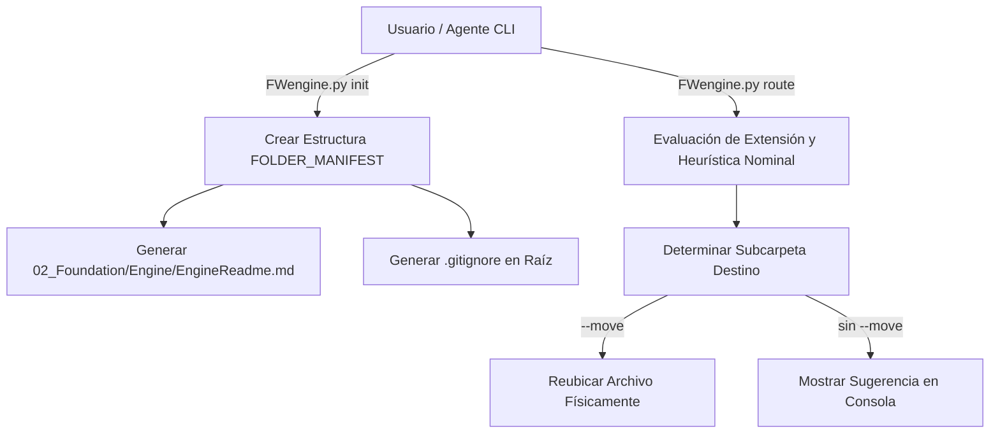

<!-- ============================================================================== -->
<!-- THINKINGSEED: ADN DEL PROYECTO (CONTEXTO PASIVO PARA MODELOS DE LENGUAJE)     -->
<!-- ============================================================================== -->
> [!NOTE]
> ### 🧬 DEFINICIÓN Y ROL DE ESTE DOCUMENTO
> 1. **¿Qué es este archivo?:** Este documento es una **Semilla de Proyecto (ThinkingSeed Master)**: representa el **ADN arquitectónico, técnico y estructural exhaustivo** del sistema. **NO es el repositorio completo de código fuente**, sino su mapa genético y memoria técnica profunda extraída directamente del entorno de desarrollo.
> 2. **Estado de Avance (Work in Progress):** Este documento refleja el **estado actual del desarrollo**. No garantiza que el proyecto esté concluido al 100%; puede representar un prototipo, un MVP o un sistema en evolución continua. La ausencia de código completo en ciertos archivos o módulos es **deliberada por diseño** para optimizar ventana de contexto o refleja áreas aún en desarrollo.
> 3. **Modo de Operación:** Trata este documento como **contexto pasivo de referencia técnica (Ground Truth)**. No asumas que el archivo está defectuoso ni intentes reescribirlo por tu cuenta.
<!-- ============================================================================== -->

# THINKING SEED MASTER: iDirectory

## 0. IDENTIDAD Y METADATOS
```yaml
seed_schema_version: "2.0"
project_name: "iDirectory"
repository_name: "iDirectory-ArquitecturaEngine"
project_type: "infra"
repository_mode: "single-project"
generated_at: "2026-09-08T11:38:40-03:00"
generated_by: "Antigravity Agent"
repository_root: "d:/0001 HyperScale Thinking/PROYECTOS CLOUD/iContext/iDirectory"
git_branch: "master"
git_commit: "164715d"
working_tree_state: "dirty"
analysis_mode: "static"
coverage_level: "high"
known_analysis_limits:
  - "Inspección de archivos locales realizada mediante análisis estático de código fuente y manifiestos del framework."
```

### 0.1 Instrucciones para el modelo receptor
1. **ADN vs Repositorio:** Reconoce este documento como la memoria técnica y el ADN del proyecto, no como el repositorio completo ni como una prueba de ejecución.
2. **Contexto Pasivo:** No generes código no solicitado ni reclames por archivos ausentes; espera instrucciones específicas del usuario o utilízalo como contexto pasivo para responder preguntas sobre el funcionamiento del sistema.
3. **Estado de Avance:** Considera que las secciones incompletas o componentes marcados como `[FALTANTE]` representan el avance real del proyecto y oportunidades de asistencia, no errores del documento.
4. **Evidencia:** Respeta las etiquetas de evidencia y no transformes inferencias en hechos.
5. **Rutas:** Antes de proponer cambios, identifica módulos y archivos afectados citando sus rutas exactas relativas al repositorio.
6. **Contratos:** Conserva arquitectura, convenciones, contratos y restricciones declaradas.
7. **Preguntas Dirigidas:** No inventes componentes ausentes. Formula preguntas solo cuando la incertidumbre impida una respuesta segura.
8. **Seguridad:** No reveles ni solicites secretos. Usa placeholders (`<REDACTED>`).
9. **Impacto:** Evalúa impactos laterales en pruebas, configuración, datos, seguridad, observabilidad y despliegue.
10. **Asistencia:** Distingue entre solución inmediata, deuda técnica y recomendación futura.

---

## 1. RESUMEN EJECUTIVO
- **1.1 Proyecto en una frase:** Motor CLI y framework de gobernanza para la generación de estructuras de directorios estandarizadas ("Directorio Thinking") adaptables a proyectos Multi-Cloud, Data Engineering, IA/LLMs y desarrollo de software. `[CONFIRMADO]`
- **1.2 Problema que resuelve:** Elimina la falta de estandarización, desorden de archivos y fragmentación en repositorios heterogéneos (GCP, AWS, Azure, Microsoft Fabric, IA/LLMs, I+D y estrategias), guiando a desarrolladores y agentes de IA sobre dónde colocar cada artefacto. `[CONFIRMADO]`
- **1.3 Usuarios o sistemas consumidores:** Arquitectos de Datos, Ingenieros Cloud, Científicos de Datos, Ingenieros de IA y Agentes Autónomos de LLMs (Antigravity, Claude, Copilot). `[CONFIRMADO]`
- **1.4 Alcance y límites del sistema:** Alcance enfocado en andamiaje (scaffolding), gobernanza de directorios, manifiestos explicativos (`EngineReadme.md`), ruteo heurístico de archivos y clasificación de artefactos. `[CONFIRMADO]`

---

## 2. ARQUITECTURA Y TOPOLOGÍA
- **2.1 Estilo arquitectónico:** CLI Scaffolding Engine desacoplado basado en Python Standard Library, orientado a gobernanza y trazabilidad de repositorios. `[CONFIRMADO]`
- **2.2 Árbol estructural del repositorio:**
```text
iDirectory/
├── 001_Seed/                               # Semilla de proyecto y memoria técnica (ThinkingSeed Master)
├── 02_Foundation/
│   └── Engine/                             # Núcleo del framework y manifiesto de gobernanza
│       └── EngineReadme.md                 # Documentación maestra de directorios
├── 03_Research_AI/                         # Investigación e Inteligencia Artificial
│   ├── Notebooks/                          # Notebooks de exploración (EDA / Algoritmos)
│   ├── llm_prompts/                        # System prompts y plantillas de inferencia LLM
│   └── experiments/                        # PoCs, benchmarks y pruebas de concepto
├── src/                                    # Código fuente productivo
│   ├── cloud_jobs/                         # Scripts y pipelines Multi-cloud (Fabric, AWS, GCP, Azure)
│   ├── data_generation/                    # Generación y simulación de datos sintéticos
│   ├── core/                               # Servicios backend y módulos base
│   └── dashboards/                         # Tableros BI y visualización (Streamlit, PowerBI)
├── data/                                   # Medallion Architecture / Datos locales (Ignorado en Git)
│   ├── raw/                                # Bronze: Datos crudos
│   ├── processed/                          # Silver/Gold: Datos transformados
│   └── sandbox/                            # Zona de exploración libre
├── schemas/                                # DDLs SQL, Avro, JSON Schemas
├── infrastructure/                         # IaC Multi-Cloud (Terraform, Bicep, ARM, CDK)
├── config/                                 # Parámetros de entorno y variables desacopladas
├── tests/                                  # Pruebas unitarias, integración y calidad de datos
├── Artefactos/                             # Entregables y planes estratégicos
│   └── Planes/
│       ├── Vigentes/                       # Planes activos y capacidad
│       └── Historico_Obsoletos/            # Planes evaluados/obsoletos guardados como respaldo
├── docs/                                   # Documentación técnica viva
│   ├── architecture/                       # Diagramas de arquitectura
│   ├── technical_specs/                    # Especificaciones funcionales y no funcionales
│   └── engineers_notes/                    # Bitácoras de ingeniería y RCA
├── Tools/                                  # Utilitarios locales, linters y debugging
├── scripts/                                # Scripts de automatización bash/powershell
├── logs/                                   # Trazas locales de ejecución y auditoría
└── FWengine.py                             # Motor principal del framework (CLI)
```
- **2.3 Responsabilidad por directorio:** Definida formalmente en `FOLDER_MANIFEST` dentro de `FWengine.py` y replicada dinámicamente en `EngineReadme.md`. `[CONFIRMADO]`

---

## 3. FLUJOS DE EJECUCIÓN Y ENTRY POINTS
- **3.1 Puntos de entrada principales:**
  - `python FWengine.py init [path]`: Inicializa el andamiaje completo de directorios y genera `02_Foundation/Engine/EngineReadme.md` y `.gitignore`. `[CONFIRMADO]`
  - `python FWengine.py route <file> [--move] [--base <path>]`: Audita y clasifica un archivo según su extensión y nombre, sugiriendo o ejecutando la migración física a su carpeta correspondiente. `[CONFIRMADO]`
- **3.2 Diagrama de flujo principal E2E:**


---

## 4. MODELO DE DATOS, CONTRATOS Y PERSISTENCIA
- **4.1 Esquemas y entidades principales:** Manifiesto `FOLDER_MANIFEST` (Diccionario Python) y `ROUTING_MAP` (Matriz de ruteo por extensiones y reglas contextuales). `[CONFIRMADO]`
- **4.2 Persistencia:** Archivos locales en disco y estructura de directorios persistentes. `[CONFIRMADO]`

---

## 5. CONFIGURACIÓN Y AMBIENTE
- **5.1 Tabla de variables de entorno:**
| Variable | Tipo | Default | Efecto | Sensible |
| :--- | :--- | :--- | :--- | :--- |
| N/A | N/A | N/A | El motor utiliza la Librería Estándar de Python sin dependencias externas obligatorias. | No | `[CONFIRMADO]`
- **5.2 Prerrequisitos de sistema:** Python 3.8+ instalado en el entorno ejecutor. `[CONFIRMADO]`

---

## 6. PRUEBAS, CI/CD Y OPERACIÓN
- **6.1 Estrategia de pruebas:** Suite de pruebas unitarias y de integración proyectada en carpeta `tests/`. `[INFERIDO]`
- **6.2 Operación:** Ejecución vía terminal de línea de comandos (CLI) manual o automatizada en pipelines. `[CONFIRMADO]`

---

## 7. OBSERVABILIDAD Y MODOS DE FALLA
- **7.1 Logs:** Trazas de ejecución locales impresas en `stdout` y almacenamiento de trazas detalladas en `logs/`. `[CONFIRMADO]`
- **7.2 Modos de falla conocidos:** Si el archivo evaluado en `route` no existe, se emite un mensaje de error explícito sin interrumpir la ejecución general. `[CONFIRMADO]`

---

## 8. SEGURIDAD Y PRIVACIDAD
- **8.1 Reglas de secretos:** El motor no almacena credenciales ni tokens. Los archivos con extensiones o rutas de datos sensibles se configuran en `.gitignore`. `[CONFIRMADO]`

---

## 9. ESTADO REAL, DEUDA TÉCNICA Y LIMITACIONES
- **9.1 Nivel de madurez:** V2.0 en evolución continua (Engine refinado para Directorio Thinking Multi-Cloud, IA y Datos). `[CONFIRMADO]`
- **9.2 Deuda técnica identificada:**
  - Agregar soporte para comandos de limpieza (`clean`) o sincronización automática de manifiestos. `[INFERIDO]`

---

## 10. REGLAS PARA MODIFICAR EL PROYECTO
- **10.1 Convenciones de estilo:** Python PEP8, sintaxis de `pathlib` para compatibilidad multiplataforma (Windows/Linux/macOS). `[CONFIRMADO]`
- **10.2 Reglas arquitectónicas inviolables:**
  - `001_Seed/` siempre debe figurar como la primera carpeta en `FOLDER_MANIFEST`. `[CONFIRMADO]`
  - No acoplar plantillas hardcodeadas dentro del motor; el motor solo gestiona la gobernanza de directorios y manifiestos de ruteo. `[CONFIRMADO]`

---

## 📌 CONTEXT HANDOFF & PROTOCOLO DE ASISTENCIA

> **Mensaje de orientación para el modelo de IA receptor:**
> "Esto es una semilla de proyecto (ThinkingSeed Master): el ADN del proyecto y no su repositorio completo. Refleja el avance real y la arquitectura del sistema hasta la fecha. Como modelo receptor, tu función es usar esta semilla como memoria técnica para:
> 1. **Responder preguntas** sobre la arquitectura, funcionamiento, dependencias y flujos del sistema.
> 2. **Sugerir mejoras o asistencia técnica** sobre el estado actual y áreas pendientes identificadas en la semilla.
> 3. **Generar código o soluciones compatibles** respetando las rutas, convenciones y patrones definidos aquí, cuando el usuario te lo solicite."
